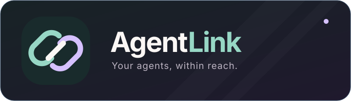

<p align="center">
  
</p>

<p align="center">
  <strong>电脑上的 coding agent，现在手机也能聊。</strong><br>
  手机上发起任务、查看进展，回到电脑终端接着同一段对话。
</p>

<p align="center">
  <a href="https://github.com/gongpx20069/android-agent-link/releases"><strong>下载 Android APK</strong></a>
  &nbsp; · &nbsp; <a href="README.md">English</a>
  &nbsp; · &nbsp; <a href="docs/user-guide.zh-CN.md">使用指南</a>
  &nbsp; · &nbsp; <a href="https://gongpx20069.github.io/hi-mochi/zh-CN/agentlink/"><strong>AgentLink 官网</strong></a>
</p>

**GitHub Copilot CLI · Claude Code · Kimi Code · Qwen Code · DeepSeek Harness**

一个 Android App，连接多个 Agent、项目和电脑。

**图片输入（0.0.39+）：** 可添加一张截图或照片，预览后发送给支持图片的 Agent/模型，
也可以附带文字。需要同时更新 **App 和 Bridge**；详见[发送图片](docs/user-guide.zh-CN.md#发送图片)。

## 快速开始

### 1. 下载 App

在 **Android 8.0+** 手机上安装最新 [Release](https://github.com/gongpx20069/android-agent-link/releases)
中的 `agentlink-0.0.x.apk`。当前版本标记为 **Pre-release（预发布）**。

### 2. 在电脑上启动 Server

电脑需要 **Python 3.11+、Git，以及至少一个已经安装并配置好的 coding agent**。
不用全部安装，选择你常用的即可；参见[支持的编程助手](#支持的编程助手)。
项目文件和 agent 都留在电脑上，不在手机上运行。

首次使用，在 **Windows PowerShell** 中执行：

```powershell
git clone https://github.com/gongpx20069/android-agent-link.git
cd android-agent-link
python -m venv .venv
.\.venv\Scripts\python.exe -m pip install -e .\bridge
.\.venv\Scripts\python.exe .\bridge\run.py start
```

已经安装过？之后只需运行最后一条启动命令。
如有 Dev Tunnels 登录提示，按终端说明完成登录。默认使用私有认证连接，
**无需开放入站防火墙端口，手机也无需额外安装 VPN App**。
保持电脑唤醒，并让这个终端继续运行。

- Server 启动后会显示配对二维码，手机打开 **Machines → Scan QR** 扫码。
  核对两端确认码，在电脑的配对提示处输入 **`y`** 批准。
- 手机进入 **Chats → New Chat**，选择电脑、agent 和**电脑上的项目目录**，
  例如 `C:\Repos\my-project`，然后发送消息。

**到这里就可以在手机上聊天了，不需要开启终端聊天模式。**

### 3. 可选：电脑终端同步接着聊

等正在运行的任务结束后，按 Ctrl+C 停止 Server。在同一个仓库目录安装一次终端扩展，
然后以交互模式重新启动：

```powershell
.\.venv\Scripts\python.exe -m pip install -e ".\bridge[interactive]"
.\.venv\Scripts\python.exe .\bridge\run.py start --interactive
```

在 Android 打开聊天。只有一个 Chat 且终端草稿为空时会自动选中，**直接打字接着聊**；
多个 Chat 用 **`/chats`** 切换。此模式下若需要配对，输入 **`/qrcode`** 显示二维码，
核对确认码后按 Esc 返回，再输入 **`/pair y`** 批准。

手机与终端共用同一个 agent 会话、消息、任务队列和审批状态。
这里使用的是 AgentLink 终端界面，不是另开一段互不相干的 agent CLI 对话。

## 换个屏幕，工作继续

| 随时掌握进展 | 随时接着工作 |
| --- | --- |
| 查看流式回复和工具执行情况 | 切换不同电脑、项目和 Chat |
| 在手机上批准或拒绝 agent 请求 | 恢复 agent 提供的已有会话 |
| Android 长按选字复制 | 终端鼠标拖选、滚动查看 |
| 待发送消息紧凑预览，点击展开 | 长历史按需加载，不必一次读入全部 |

## 支持的编程助手

创建 Chat 时选择 Agent。每个 Chat 独立绑定 Agent、项目和会话；
切换 Chat 不等于把上下文迁移给另一个厂商。

| Agent | 电脑端准备 | 会话恢复 |
| --- | --- | --- |
| **GitHub Copilot CLI** | 安装 CLI 并在本地登录；[原生 SDK 连接说明](bridge/README.md#copilot-background-task-lifecycle) | 上下文与历史 |
| **Claude Code** | 本地 Claude 认证 + [Claude ACP 适配器](bridge/README.md#claude-code) | 上下文与历史 |
| **Kimi Code** | 新版 JavaScript Kimi Code + `kimi login`；[安装说明](bridge/README.md#kimi-code-and-qwen-code) | 上下文与历史 |
| **Qwen Code** | 安装 Qwen Code 并完成本地认证；[安装说明](bridge/README.md#kimi-code-and-qwen-code) | 上下文与历史 |
| **DeepSeek Harness** | 固定预览版本并配置本地 Provider；[安装说明](bridge/README.md#deepseek-harness) | 仅上下文，不回放旧消息 |

上表描述**当前源码的支持情况**。下载的 APK 以发布说明为准；
新接入的 Agent 可能需要同时更新 App 和 Bridge。版本及运行环境要求见各安装说明。
列表显示“已安装”不代表模型认证已经成功。

模型、推理和权限选项以 Agent 实际提供的能力为准。
AgentLink 会保留已保存消息，但无法导入 DeepSeek Harness 外部会话的旧历史。
手机与电脑共用 AgentLink 的终端界面，不是镜像另一个独立运行的厂商 CLI。

## 需要时再看

| 想了解 | 入口 |
| --- | --- |
| 终端快捷键、复制、模型和权限 | [终端使用指南](docs/user-guide.zh-CN.md#也可以在电脑终端聊天) |
| 不扫码，通过账号发现电脑 | [账号发现与配对](docs/user-guide.zh-CN.md#4-配对手机) |
| Conda、uv、纯 Server 模式和连接选项 | [Bridge 安装指南](bridge/README.md#install) |
| Agent 支持情况和兼容要求 | [编程助手说明](docs/user-guide.zh-CN.md#支持的编程助手) |
| 升级、连接问题和排查 | [常见问题](docs/user-guide.zh-CN.md#常见问题) |
| 可选：让 Mochi 操作共享 Chat | [Mochi 集成](docs/user-guide.zh-CN.md#可选mochi-集成) |
| 架构、安全与参与开发 | [技术文档](docs/README.md) · [贡献指南](CLAUDE.md) |

<details>
<summary>升级提醒与连接限制</summary>

签名发布版可覆盖升级之前的签名发布版。不要通过卸载或清除数据解决卡顿：
这会删除本地历史。升级后首次加载请保持 App 打开；旧版 APK 无法读取迁移后的聊天数据库。
如果之前安装的是 debug 包，切换到发布版可能需要先卸载。

电脑必须保持联网并运行 bridge。二维码隧道凭据过期后可能需要重新配对。
Android 后台监控目前最多一小时，不是永久在线服务。账号发现仍为预览功能，
不可用时请使用扫码配对。请勿启用隧道匿名访问。

</details>

遇到问题？[提交 Issue](https://github.com/gongpx20069/android-agent-link/issues)，
附上 App 版本与报错即可，**不要附带配对链接或令牌**。
